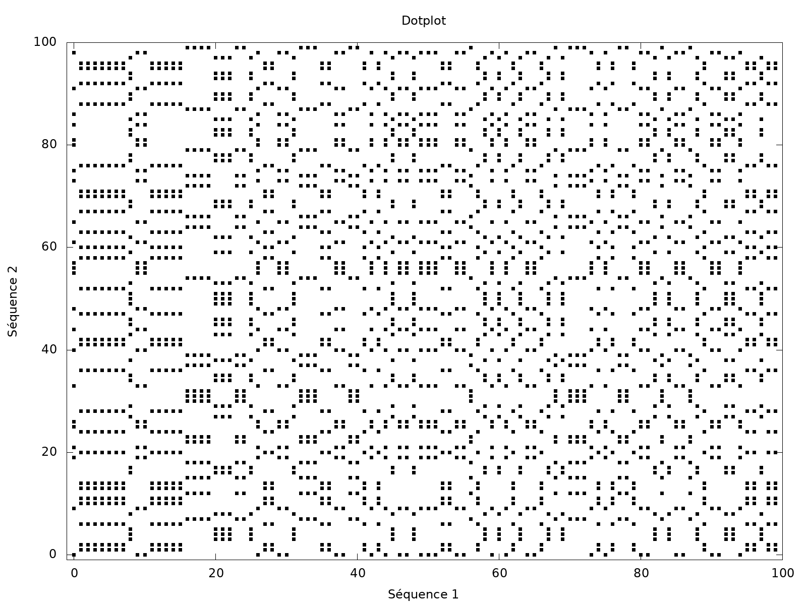

## Table des matières
1. [Info générales](#Info-générales)
2. [Screenshot](#Screenshot)
3. [Technologies](#Technologies)
4. [Installation](#Installation)
5. [Contact](#Contact)

## Info générales
Dotplot est une application qui permet de générer des dotplots de façon graphique grâce à une interface assez simplifiée 

## Screenshot


## Technologies
Liste des technologies utilisées dans le porjet
* [Gnuplot](http://www.gnuplot.info/): Version 5.4

## Installation
Premièrement, instaler gnuplot
```
$ sudo apt-get gnuplot
```
Comment utiliser l'application 
```
$ git clone https://github.com/CamilleCarrette/Dotplot
$ make
$ ./dotplot
Suivre les instructions de l'interface
```

## Contact
Pour rentrer en contact avec nous :
* camille.carrette@outlook.com
* louis.remy09@yahoo.com
* elodie.laborde@etu.umontpellier.fr